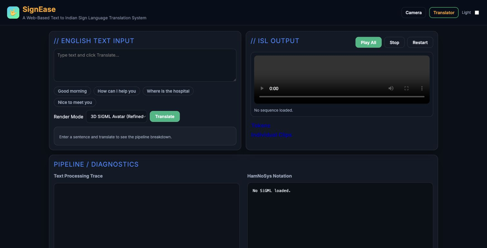
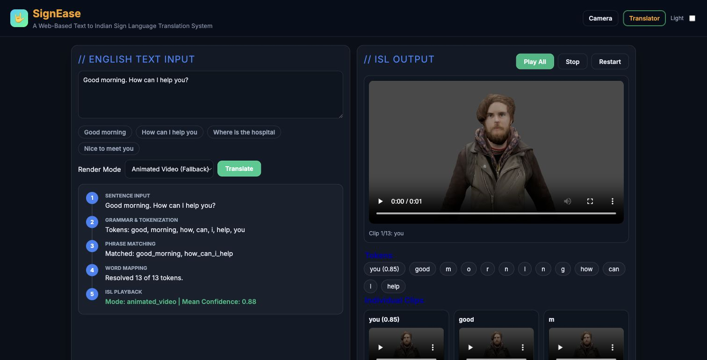

# SignEase

Multimodal Indian Sign Language translation system with a FastAPI backend, browser UI, sign-video rendering, optional camera recognition, and SiGML/avatar support.

## Screenshots

Static recruiter demo page: <https://h-rsh-19.github.io/signease/>





## What It Does

- Converts text input into Indian Sign Language render sequences.
- Supports multiple render modes:
  - human sign videos
  - animated sign videos
  - SiGML/avatar rendering
- Exposes REST and WebSocket APIs for translation and recognition.
- Serves a browser UI from `static/`.
- Supports optional YOLO/Ultralytics model loading for camera-based recognition.

## Why This Project

SignEase is an accessibility-focused project. It combines backend APIs, local media catalogs, browser UI, and computer-vision-ready recognition endpoints into one working prototype.

For reviewers, the important signal is that this is not only a static page: the FastAPI backend tokenizes input text, maps phrases to available media assets, renders a playable sequence, and exposes diagnostics for the translation pipeline.

## Tech Stack

- Python
- FastAPI
- Uvicorn
- JavaScript
- HTML/CSS
- Pydantic
- NumPy / Pillow
- Optional Ultralytics YOLO

## Structure

```text
app/
  main.py
  api/routes.py
  services/
    asset_catalog.py
    recognition.py
    renderer.py
    text_pipeline.py
static/
  index.html
  app.js
  styles.css
data/
  animated_videos/
  human_videos/
  sigml/
docs/screenshots/
```

## Setup

```bash
python -m venv .venv
source .venv/bin/activate
pip install -r requirements.txt
```

On Windows:

```bash
python -m venv .venv
.venv\Scripts\activate
pip install -r requirements.txt
```

## Run

```bash
uvicorn app.main:app --reload --port 8010
```

Open:

```text
http://127.0.0.1:8010
```

## API

- `GET /api/assets/health`
- `GET /api/assets/file?path=...`
- `POST /api/recognition/frame`
- `WS /api/recognition/stream`
- `POST /api/translation/text`
- `POST /api/render/sequence`

## Optional YOLO Recognition Model

Place a YOLO model at:

```text
models/yolov5/best.pt
```

Or set:

```bash
export TRIAL3_YOLO_MODEL_PATH=/path/to/best.pt
```

If the model or package is unavailable, the API still runs and returns diagnostics with `model_loaded=false`.

## Validation

Smoke-test the core API without starting a browser:

```bash
python scripts/smoke.py
```

Expected result:

```text
assets 200
translate 200
render 200
```

## Notes

- Media assets are included so the app can render common signs locally.
- Asset manifests are generated at startup.
- Camera/image dependencies are optional for startup; the translator path works without YOLO weights.
- This is a prototype/research project, not a production accessibility service yet.

## What I Learned

- Designing a FastAPI service around media-heavy workflows.
- Building a browser UI for translation and render preview.
- Organizing sign-language video and SiGML assets.
- Creating fallback behavior when ML models are optional.
- Connecting text processing, rendering, and recognition endpoints in one app.
